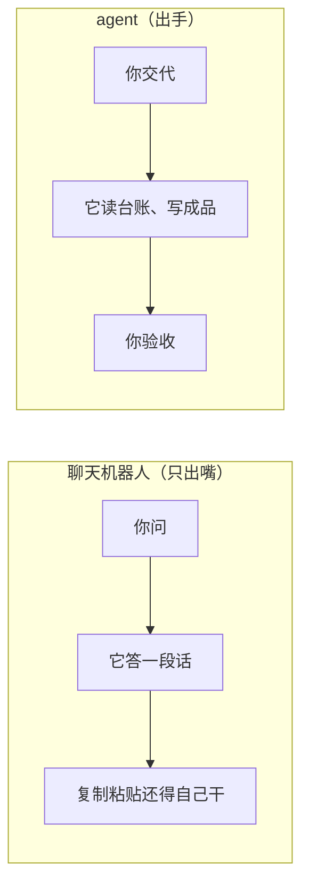
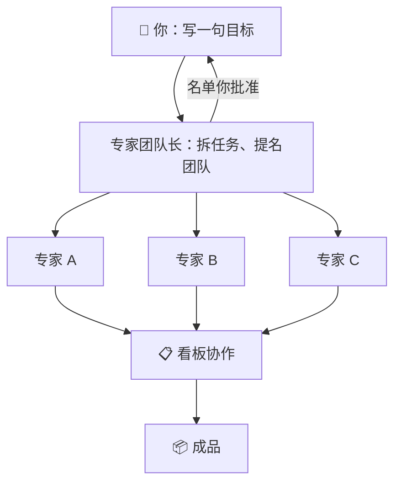

# 预备课：OpenWorker 用到的基础概念

> 给完全没接触过电脑术语的同事。**自学约 30 分钟**；也可由讲师在第一次课前用 15 分钟带过。
>
> 读法：每个概念一句话＋一个类比，**不用背**——两次课上手做，做完自然懂。忘了回来翻最后的速查小词典。

---

## 第一级 · 东西放在哪：文件的世界

**文件**：存起来的一份内容。一张检验记录表、一份周报、一张照片，各是一个文件。类比：**一张纸**。

**文件夹**（也叫目录）：装文件的抽屉，抽屉里能再放小抽屉。类比：**档案柜**。

**路径**：文件的门牌地址——哪个盘、进哪些抽屉、到哪张纸，一路写下来：

```
D:\OpenWorker培训\01-质量周报\检验记录.xlsx
│  │              │           └── 文件本人
│  │              └── 小抽屉（子文件夹）
│  └── 大抽屉（文件夹）
└── D 盘（柜子）
```

类比：**省 → 市 → 街道 → 门牌号**。培训里说「把文件夹给它」，给的就是这个地址。

**扩展名**：文件名最后那个「点＋字母」，标明这是哪种纸——`.docx` 是 Word，`.xlsx` 是 Excel 表，`.pdf` 是打印稿，`.md` 是纯文字。类比：**文件袋上的标签**。

**本地与云端**：存在自己电脑上叫本地，存在别人服务器上（网盘、网页）叫云端。
**OpenWorker 的会话和成品都在你本地**——这是它跟网页 AI 的重要区别。

---

## 第二级 · 电脑怎么听使唤：程序与命令

**程序**（应用）：会干活的工具，双击打开。Excel 是程序，微信是程序，OpenWorker 也是装在你电脑上的一个程序。

**命令**：使唤电脑的另一种方式——不点鼠标，打一句规定格式的文字，电脑照办。程序员整天用它批量干活，比如一句话给 300 个文件改名。

**你一条命令都不用学**——这正是用 OpenWorker 的意义：


课上看到它说「要执行命令」、给你看一行看不懂的字，别慌——那是它在替你使唤电脑，**你点允许才会执行**。

**API 与 key**：程序跟程序打交道也有「门」，那扇门叫 API；进门要出示的通行证叫 key。
OpenWorker 替你去调模型，走的就是 API；管理员发给你的那把 key，就是以你名字命名的通行证——别转发、别贴群里。
类比：**单位间的公函通道＋你的介绍信**。

---

## 第三级 · AI 是个什么：模型五件套

**大语言模型（LLM）**：读过海量文字、会接着你的话往下写的「大脑」。三个脾气要知道：

1. 能读会写，快得吓人；
2. **不长记性**——本身记不住昨天的事（所以要靠「会话」替它记）；
3. **偶尔一本正经地说错**（所以要喂真台账、要检查成品）。

类比：**一位读遍全图书馆的顾问，聪明绝顶，但今天第一天来公司**——公司的事，你不给他看台账，他就只能猜。

第 3 条「一本正经地说错」有个学名，叫**幻觉**——模型不知道的事也敢编，编得还挺像。
防法就两条：喂真台账、检查成品。类比：**顾问没查资料也敢答**，所以要让他附出处。

**token**：模型的计量单位，读和写都按 token 数着算钱。类比：**出租车跳表**。自己的用量在 **设置 ▸ 模型** 里能看到。

**提示词**：你交代给模型的那段话。交代得越清楚，干得越对——所以第一课教「三要素」：读什么、要什么、存成什么。类比：**派工单**，写得清楚活才对版。

**上下文**：模型此刻「脑子里装着」的东西——你说过的话＋它读过的文件。装不下就会忘。类比：**办公桌就那么大**，纸摊多了就找不着——所以一事一会话，别把十件事塞进一个会话。

---

## 第四级 · 从「会聊」到「会干」：agent 的世界

**agent**（应用里叫**协作代理**，外面也常译作「智能体」）：不光会聊天、还会**动手**的 AI——自己拆步骤、读文件、写文件、发消息，一步步做到交货，每次动手先问你。



**会话**：你和 agent 的一次合作。授权过的文件夹、聊过的话，都记在这个会话里。**一事一会话**，回头好找。

**技能（skill）**：给 agent 装的**作业指导书**。装了「docx」技能它就会做 Word 文档；库里现成的多是科研技能，本行业的操作规程也可以自己写成技能装给它。在**专家库 ▸ 技能**里点「安装技能」。类比：**发给新员工的操作规程（SOP）**，照着做就专业。

**连接器**：让 agent 用上外部工具的**插座**——微信、日历、GitHub……插上才能用，**每一个都要你亲手授权**。类比：**门禁卡**，你给哪张卡，它才进得了哪扇门。

**MCP**：给外部工具定的**通用接口标准**（Model Context Protocol）——工具照它做成「插座」，就能插进 OpenWorker。内置的几十个连接器之外，任何支持 MCP 的工具也能接进来，一样逐个授权；界面里就是「连接器」页旁边的「MCP 服务器」标签，日常用不着碰。类比：**插座的国标**，孔位统一，谁家的电器都能用。

**自动化**：预先写好的派工单＋闹钟。到点自动开一个会话照单干活，结果发到微信或留在应用里。第二次课的主角。

**工作流**：固定下来的一串步骤——谁先谁后、产物交给谁。这是个说法，不是按钮，界面里没有叫「工作流」的功能：自动化就是「定时跑的工作流」，专家团就是「多人分工的工作流」。类比：**车间的工艺路线**——路线定了，谁来干都一个走法。

**审批与收件箱**：agent 每次要动手（写文件、发消息、执行命令）都先问你，你点头才动；你不在时，请求攒进**收件箱**等你回来批。类比：**干活要签字**——你不在，单子就压在你桌上。

---

## 第五级 · 一个人不够用：专家与专家团

**专家**：写好的资深人设＋行业套路，让 agent 张口就像那个岗位干了二十年的老手。专家库里有 270 多位，即点即用。类比：**外聘顾问名录**，随叫随到、不占编制。

**专家团**：挑 2–6 位专家，组一个临时项目组干一件大活。内置的**专家团队长**先把任务拆开、向你**提名团队**，你批准后他们在看板上分工协作，直到交出成品。

类比：**临时抽调骨干成立的专项组**——组长挂帅、分工干完、交活解散。这里换成：团队长挂帅、专家们参加、你来批准名单。



---

## 速查小词典

| 词 | 英文 | 一句话 |
| --- | --- | --- |
| 文件 | file | 存起来的一份内容，像一张纸 |
| 文件夹 / 目录 | folder | 装文件的抽屉，能套抽屉 |
| 路径 | path | 文件的门牌地址，如 `D:\OpenWorker培训\…` |
| 扩展名 | — | 文件名末尾的标签：.docx=Word、.xlsx=表格 |
| 本地 / 云端 | local / cloud | 在你电脑上 / 在别人服务器上 |
| 程序 / 应用 | app | 会干活的工具，双击打开 |
| 命令 | command | 用一句文字使唤电脑；你不用学，它替你打 |
| API / key | — | 程序之间的门＋你的通行证；key 以你名字命名，别外传 |
| 大语言模型 | LLM | 读过海量文字、会接话的大脑；聪明但不了解公司 |
| 幻觉 | hallucination | 模型一本正经地说错；喂真台账、查成品来防 |
| token | token | 模型的计量单位，按它算钱，设置▸模型里可查 |
| 提示词 | prompt | 你交代的那段话；三要素写清楚 |
| 上下文 | context | 它此刻脑里装的东西；装不下会忘，一事一会话 |
| agent / 协作代理 | agent | 会动手用工具把活干完的 AI |
| 会话 | session | 与 agent 的一次合作 |
| 技能 | skill | 装给 agent 的作业指导书（SOP） |
| 连接器 | connector | 外部工具的插座，逐个授权 |
| MCP | — | 外部工具的通用接口标准；支持它的工具都能接进来，逐个授权 |
| 自动化 | automation | 派工单＋闹钟，到点自己干 |
| 工作流 | workflow | 固定的一串步骤；是说法不是按钮，自动化＝定时跑的工作流 |
| 收件箱 | inbox | 你不在时，待批的事攒在这儿 |
| 专家 | expert | 现成的资深人设，270+ 位即点即用 |
| 专家团 | expert team | 几位专家的临时项目组，干一件大活 |
| 专家团队长 | team lead | 拆任务、提名团队、盯看板；名单你批准才开工 |

---

*概念讲到这就够了——剩下的交给两次课：[第一次培训](./01-第一次培训-把一件事交给它做完.md)、[第二次培训](./02-第二次培训-让它按时自己干活.md)。*
