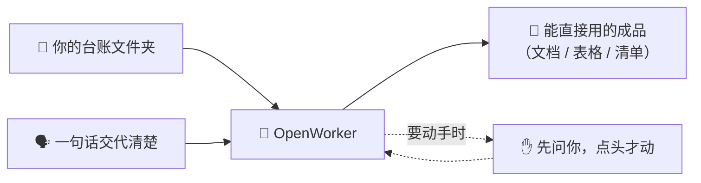

# 第一次培训：把一件事交给它做完

> 约 2 小时。学员要求：装好 OpenWorker、能登录（照[用户手册](../手册/03-用户手册.md)第 1–3 步）。
> 讲师每一步都先投影演示，学员再在自己机器上跟做。

| 时间 | 环节 |
| --- | --- |
| 0:00–0:20 | 这是什么 + 每人登录检查 |
| 0:20–0:50 | 实务一：质量周报 |
| 0:50–1:20 | 实务二：交期风险排查 |
| 1:20–2:00 | 换自己部门的数据练 + 答疑 |

---

## 这是什么

一句话：**装在你自己电脑上的 AI 助手，给它文件夹和一句话，还你一份能直接用的成品。**

它跟网页聊天机器人的区别就一条：**聊天机器人给你一段话，它给你一个文件。**
它会自己把任务拆成几步、读你授权的文件、写出成品——每次要写文件或发消息，都先问你。

开场时把三件事说清（各一句话）：

1. **key 是以你名字命名的公司资产**——别转发、别贴群里。
2. **会话记录只存你电脑**——发给模型的内容经公司自己的网关转发，网关只记用量、不记内容。
3. **它动手前一定先问你**——写文件、发消息、执行命令，都要你点头。

### 每人检查（2 分钟）

打开 **设置 ▸ 模型**，Gemini 登录卡片上能看到「今日：12/1200 次请求 · 34k/5M tokens」这样一行，就是通的（数字是已用/上限，不用管它）。
看不到的，照[用户手册](../手册/03-用户手册.md)第 2–3 步补登录、补 key，讲师巡场帮忙。

第一次打开应用会有**新手引导**（小卡片圈重点位置），让学员自己点完，一分钟的事。

---

## 实务一：质量周报

**谁的痛**：质量安全部每周五要把一周的检验记录汇总成周报——翻记录、抄数字、排版，半天没了。

### 跟我做

1. 点**新建会话**。
2. 输入任务，**文件夹路径直接写在话里**（在资源管理器地址栏复制、粘过来），回车：

   > 通读 `D:\OpenWorker培训\01-质量周报` 这个文件夹里本周的检验记录和质量报告，汇总不良、返修与报废情况，指出重复出现的问题和值得关注的趋势，写成一份质量周报，保存为 Word 文档。

   > 讲师注：**文件夹拖不进输入框**，Excel/Word 单个文件也拖不进（会被静默忽略）——能拖进去的只有图片、PDF 和纯文本。所以教大家写路径，一招走遍。
3. 它会弹一张**授权卡**问你要这个文件夹的钥匙——点「**设为工作目录**」（有的授权卡上叫「授予访问权限」）。
4. 看它干活：界面上出现「N 步」的折叠条，点开能看它每步做了什么。要**写文件**时它会再问一次，点「**允许一次**」（旁边的「每次都允许」这堂课先不用）。
5. 拿成品：会话里出现周报文件，点「在文件夹中显示」就能找到，双击打开检查。

> 讲师注：Word 格式靠专家库里的「docx」技能（课前准备已装并**实测过一次**——没实测过就别在投影上现场赌）。没装的机器上它多半给出 Markdown 文档：内容不受影响，右栏还能直接预览，现场补装再让它「转成 Word」即可。

### 关键一课：不满意就追着改

> 讲师注：三条追问当堂只演示第一条，其余两条留到 1:20 后的自由练习——等它生成的空档，正好板书三要素。

成品是初稿，不是终稿。直接在同一个会话里说：

- 「返修那节按车间分开统计。」
- 「加一段『下周关注点』。」
- 「格式照文件夹里那份上周周报来。」

改完它重新保存，还是那个文件。**这一步是整堂课的灵魂**——学员学会追问，就再也不会说「它做得不对所以没用」。

### 交代任务的三要素（板书）

| 要素 | 例子 |
| --- | --- |
| 读什么 | 「这个文件夹里本周的检验记录」 |
| 要什么 | 「汇总不良、返修与报废，指出重复问题」 |
| 存成什么 | 「保存为 Word 文档」 |

（应用内帮助里也有一套「三个要素」：要什么／给谁看／依据在哪——同一件事的另一种切法，「依据在哪」≈读什么，学员看到别慌。）

### 换你部门的数据试

- 体系认证组：拿一批内审记录，让它汇总不符合项和整改状态。
- 各基地质检：拿本基地当月检验记录，出一份月度小结。

---

## 实务二：交期风险排查

**谁的痛**：生产计划组（PMC）每次排产会前，要从订单、排产、进度三张表里人肉找出「要延期的单子」。

### 跟我做

1. **新建会话**（跟实务一分开，一事一会话，回头好找）。
2. 输入（路径还是写在话里）：

   > 检查 `D:\OpenWorker培训\02-交期风险` 这个文件夹里的订单清单和排产、进度记录，找出交期临近但进度落后的订单，按风险高低排序并说明原因，整理成一张表格保存下来。

3. 授权、看步骤、拿成品——流程和实务一完全一样，这次让学员自己走，讲师只在卡住时救场。

### 追问练习（这次按 PMC 的真实口径）

- 「只看两周内要交货的。」
- 「缺料导致的和工序拖期导致的分开列。」
- 「每张高风险订单给一条建议措施。」

### 提示两件小事

- **多张表它自己会对**——不用你先把三张表合成一张。
- **说话比打字快**：点输入框旁的麦克风直接讲，中英文自动识别，识别在本机跑、不上传。
  （第一次用要先在 **设置 ▸ 语音输入** 下载识别模型并测一次麦克风——课前准备清单里已让讲师提前装好。）

### 换你部门的数据试

- 供应链部：长周期物料到货计划 × 采购订单，找「影响齐套的在途料」。
- 市场商务部·商务组：合同交期 × 发货记录，核对哪些合同该催验收了。

---

## 收尾（1:20 之后）

**自由练习**：让每人从自己电脑里挑一个真实文件夹（或拷贝样例数据改造），
用「三要素」交代一件自己部门的事，做出一份成品。讲师巡场。

**布置作业**：下次课前，每人至少独立完成一次「文件夹 → 成品」。
遇到问题先翻应用里的手册（**头像 ▸ 使用帮助**），再问管理员。

**预告**：这两件事每周都要做，难道每周都手动来一遍？——下次课教它**自己按时干，结果发到微信**。
