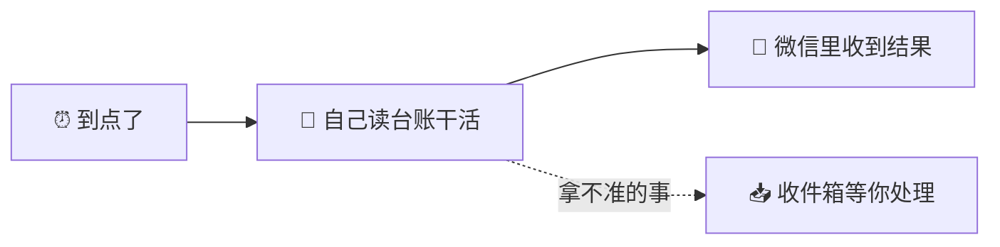
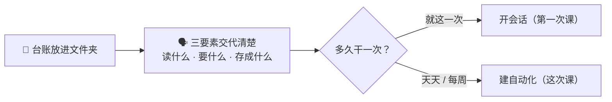

# 第二次培训：让它按时自己干活

> 约 2 小时。学员要求：上过第一次课，手机微信在手边。
> 上次学的是「你交代一次，它做一次」；这次学的是「你交代一次，它天天做」。

| 时间 | 环节 |
| --- | --- |
| 0:00–0:15 | 复习 + 连微信 |
| 0:15–0:50 | 实务三：每日点检提醒 |
| 0:50–1:20 | 实务四：备件库存预警 |
| 1:20–2:00 | 四个实务背后的同一个套路 + 各部门认领第一个自动化 |

---

## 复习作业（5 分钟）

请两位学员投影展示上次的作业成品，各说一句自己用的「三要素」；
没做出来的说卡在哪一步，当场归类——多半不是授权就是路径，两分钟讲透。

## 先连微信（全员，10 分钟）

结果要发到手机上，先把微信接好：

1. 点左下角**头像 ▸ 连接器**（这一页管它能连上的外部应用），找到「微信」，点连接，选「扫码连接」。
2. 手机微信扫码并确认。微信里会多出一个**机器人会话**——它是个独立身份，不是你自己的号。
3. **在微信里给这个机器人会话发一句「你好」**——一会儿建自动化选接收人，列表里才会有你；只扫码不发消息，选人列表是空的。
4. 扫码的人自动进白名单，你直接就能收到它发的消息。

三句要点（讲师口播即可，细节在[微信接入手册](../手册/05-微信接入.md)）：

- 只有**私聊**可靠，别指望拉它进群。
- 它只能回**文字**，发不了图片和文件。
- **应用开着才收发**——电脑关了，微信那头就没人了。

---

## 实务三：每日点检提醒

**谁的痛**：设备动力组每天早上要对着点检表和维修记录，想清楚今天该查哪几台、上次的问题闭环了没。
各基地维保技术组同理。

### 跟我做

1. 打开**自动化**页，在「从模板开始」里选「**每日点检提醒**」（这个模板固定发微信，不用选发送方式）。
2. 在「**发送给（微信联系人）**」里选自己——刚才给机器人发过「你好」，列表里才有你。
3. **何时**保持默认（工作日早上），底下的同意句保持勾选，点「**创建自动化**」。
4. 创建完会自动打开这条自动化：点「**编辑**」，把指令里的「工作文件夹」换成实际路径，点「**保存**」：

   > 查看 `D:\OpenWorker培训\03-设备点检` 中的点检表、设备台账和近期维修记录，整理出今天的设备点检提醒：待检设备与检查要点，以及此前发现但尚未闭环的问题。……

5. 别等明天——点「**▶ 立即运行**」当场测试。十几秒到几分钟后，手机微信收到今天的点检提醒。

### 讲清三个新概念

| 概念 | 一句话 |
| --- | --- |
| 运行记录 | 每次运行都是一个完整会话，点开能看它做了什么，还能继续追问 |
| 收件箱 | 无人值守时它拿不准的事（比如要新的授权）不会自作主张，攒在**收件箱**等你 |
| 补跑 | 只在应用开着时执行；错过的时间点，下次打开应用会补跑一次 |

### 换你部门的数据试

- 维保技术组：把指令里的台账换成基地设备台账，给每个基地建一条。
- 生产计划组：模板列表里还有「交期风险巡检」——就是上次课手动做的实务二，现在让它每天自己跑
  （这个模板带「发送至」二选一：应用内或微信私信）。
- 质量安全部：模板「质量周报」——上次课手动做的实务一，让它每周五下午自己跑、发到微信。

---

## 实务四：备件库存预警

**谁的痛**：仓储物流组月底盘备件，对着台账和出入库记录一行行核「哪些低于安全库存了」。

这次**学员自己来**，讲师只报要求不报步骤：

1. 回到自动化页，点「**＋ 新建自动化**」——模板网格出现后选「**备件库存预警**」
   （列表里已经有实务三那条了，模板网格这回要先点新建才露出来）。
2. 这个模板本来就不发微信、默认**每周一早上**——什么都不用选，直接点「**创建自动化**」。
3. 进详情页后点「**编辑**」，把指令里的「工作文件夹」换成 `D:\OpenWorker培训\04-备件盘点`，「**保存**」。
4. 点「**▶ 立即运行**」验证。结果不进手机——打开**运行记录**里这次的会话，看清单。

拿到的成品应该是：低于安全库存或消耗异常的备件、建议补货的品种与数量，一份简短清单。

### 换你部门的数据试

- 维保技术组：盘各基地随车备件。
- 采购组：追问一句「把预警清单转成一份询价单草稿」，直接接到下一个工作环节。

---

## 收尾：四个实务，同一个套路

带学员齐声过一遍：**质量周报**、**交期风险**、**点检提醒**、**备件预警**——四件事没一件特殊，
都是「文件夹 + 三要素 + 定不定时」。这个套路搬到任何部门都成立。

**各部门认领作业**：散场前每个部门口头认领一条「本部门的第一个自动化」，例如——

- 财务部：每周一汇总上周往来对账单，列出超期未回款。
- 技术研发部：每周把新收的图纸、试验报告归档到对应项目文件夹（模板里就有「文件归档」）。
- 市场商务部：每天一份行业动态简报（模板「行业动态简报」）。
- 综合管理部：每月初汇总上月考勤异常。

「每月一次」在界面上排不出来（何时只有按周/每天那几档）——开个会话直接说
「帮我建一个每月 1 号早上 9 点的自动化：汇总上月考勤异常」，它会替你建好。

### 学有余力的两个彩蛋

- **协作代理**：**设置 ▸ 协作代理** 里有九个本行业岗位——「质量与体系」「生产计划与排产」「设备与维护」「供应链与采购」正好对着今天四个实务。打开开关，下次开会话就能选，交代任务可以更省字。
- **专家库**：**头像（左下角）▸ 专家库**，270+ 位中文专家、160+ 个科研技能，即点即用。技术研发部的同事值得逛逛。

### 去哪求助

1. 应用里就有完整手册：**头像 ▸ 使用帮助**。
2. [用户手册](../手册/03-用户手册.md)的排障清单，常见九种情况都在。
3. 还不行找管理员。
