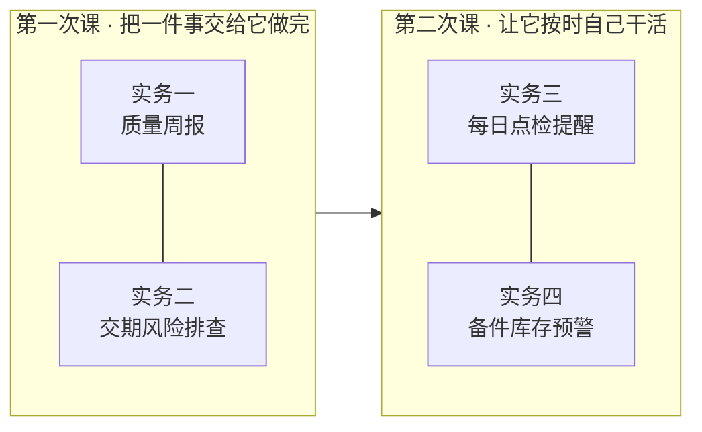

# 培训

给讲师用的一套上手材料：**四个实务、两次课**，把全体使用者从「没碰过」带到「自己会用、还会让它定时干活」。

四个实务全部取自制造企业的日常台账工作，并且**正好对应应用内置自动化模板中的四个**——
第一次课先手动做一遍（懂原理），第二次课交给模板定时跑（真省事）。



## 四个实务一览

| 实务 | 谁最该学会 | 对应内置模板 | 顺带学会的能力 |
| --- | --- | --- | --- |
| [一、质量周报](./01-第一次培训-把一件事交给它做完.md#实务一质量周报) | 质量安全部（工厂检验、体系认证、各基地质检） | 质量周报 | 开会话、授权文件夹、拿成品、追问修改 |
| [二、交期风险排查](./01-第一次培训-把一件事交给它做完.md#实务二交期风险排查) | 生产制造部·生产计划组（PMC）；供应链部、市场商务部旁听有益 | 交期风险巡检 | 多张表一起分析、按自己口径追问 |
| [三、每日点检提醒](./02-第二次培训-让它按时自己干活.md#实务三每日点检提醒) | 生产制造部·设备动力组；运营管理部·维保技术组 | 每日点检提醒 | 自动化、定时运行、微信送达 |
| [四、备件库存预警](./02-第二次培训-让它按时自己干活.md#实务四备件库存预警) | 供应链部·仓储物流组；运营管理部·维保技术组 | 备件库存预警 | 自动化再上手一遍、收件箱审批 |

两次课都是**通用课**——不是只给上面这些部门上。实务是载体，套路是通用的：
财务部拿往来账龄、技术研发部拿试验记录、综合管理部拿考勤汇总，
换个文件夹换句话，做法一模一样。每份课件末尾都有「换你部门的数据试」的变体，
第二次课散场前有**各部门认领第一个自动化**的环节。

## 讲师课前准备

### 第一次课前

- [ ] 提前两三天把[预备课](./00-预备课-基础概念.md)发给学员自学（30 分钟）；开课再用 15 分钟带过一遍。
- [ ] 每位学员照[用户手册](../手册/03-用户手册.md)第 1–3 步**装好并登录**（验证码走邮箱，别留到课上现办）。
- [ ] 每台学员机在**专家库 ▸ 技能**里搜「docx」点安装——成品要 Word 格式就靠它；顺手把「xlsx」也装上。
  装完在讲师机**实测一次「保存为 Word 文档」**，跑不通就课上统一改口「保存为 Markdown 文件」。
- [ ] 每台学员机在**设置 ▸ 语音输入**里下载好识别模型（约 148 MB，走国内镜像）并测一次麦克风。
- [ ] 准备**样例数据**（见下），放到每台学员机的同一路径。
- [ ] 讲师机连投影，提前打开应用、登录、试跑一遍实务一。

### 第二次课前

- [ ] 学员手机带上，微信在手边（实务三要扫码）。
- [ ] 讲师提前自己扫码连一次微信，确认链路是通的（见[微信接入手册](../手册/05-微信接入.md)）。
- [ ] 第一次课的样例数据还在原路径。

### 样例数据

**最好用各部门真实台账的脱敏副本**——数据越真，课上越有共鸣：

```
D:\OpenWorker培训\
├─ 01-质量周报\    检验记录（本周若干份）、不良品处理单、上周周报（当格式参考）
├─ 02-交期风险\    订单清单.xlsx、排产计划.xlsx、进度跟踪.xlsx
├─ 03-设备点检\    点检表.xlsx、设备台账.xlsx、维修记录.xlsx
└─ 04-备件盘点\    备件台账.xlsx（含安全库存列）、出入库记录.xlsx
```

没有条件就编几十行像样的假数据，注意让里面藏几个「值得被它发现的问题」
（一台设备反复坏、一张订单明显要延期、一种备件低于安全库存），演示才有戏。

## 两份课件

| 课件 | 内容 | 时长 |
| --- | --- | --- |
| [00-预备课-基础概念](./00-预备课-基础概念.md) | 从文件夹到专家团的二十四个词，零基础扫盲 | 自学 30 分钟 / 课前带过 15 分钟 |
| [01-第一次培训-把一件事交给它做完](./01-第一次培训-把一件事交给它做完.md) | 这是什么 → 实务一、二（手动开会话，拿成品） | 约 2 小时 |
| [02-第二次培训-让它按时自己干活](./02-第二次培训-让它按时自己干活.md) | 连微信 → 实务三、四（自动化模板，定时跑） | 约 2 小时 |
