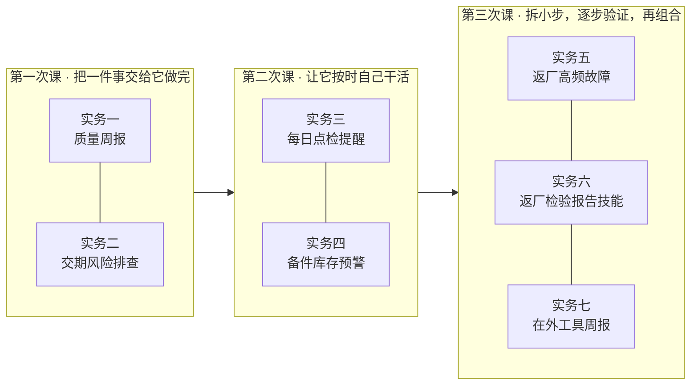

# 培训

给讲师用的一套上手材料：**七个实务、三次课**，把全体使用者从「没碰过」带到「自己会用、会让它定时干活，还会把大活拆开一步步验证」。

四个实务全部取自制造企业的日常台账工作，并且**正好对应应用内置自动化模板中的四个**——
第一次课先手动做一遍（懂原理），第二次课交给模板定时跑（真省事）。
第三次课换三个维保、租赁业务的实务，专练程序员式的套路：**拆小步，逐步验证，再组合**成技能和自动化。


```mermaid
flowchart LR
    subgraph S1["第一次课 · 把一件事交给它做完"]
        A["实务一<br/>质量周报"] --- B["实务二<br/>交期风险排查"]
    end
    subgraph S2["第二次课 · 让它按时自己干活"]
        C["实务三<br/>每日点检提醒"] --- D["实务四<br/>备件库存预警"]
    end
    subgraph S3["第三次课 · 拆小步，逐步验证，再组合"]
        E["实务五<br/>返厂高频故障"] --- F["实务六<br/>返厂检验报告技能"] --- G["实务七<br/>在外工具周报"]
    end
    S1 --> S2 --> S3
```

## 七个实务一览

| 实务 | 谁最该学会 | 对应内置模板 | 顺带学会的能力 |
| --- | --- | --- | --- |
| [一、质量周报](./01-第一次培训-把一件事交给它做完.md#实务一质量周报) | 质量安全部（工厂检验、体系认证、各基地质检） | 质量周报 | 开会话、授权文件夹、拿成品、追问修改 |
| [二、交期风险排查](./01-第一次培训-把一件事交给它做完.md#实务二交期风险排查) | 生产制造部·生产计划组（PMC）；供应链部、市场商务部旁听有益 | 交期风险巡检 | 多张表一起分析、按自己口径追问 |
| [三、每日点检提醒](./02-第二次培训-让它按时自己干活.md#实务三每日点检提醒) | 生产制造部·设备动力组；运营管理部·维保技术组 | 每日点检提醒 | 自动化、定时运行、微信送达 |
| [四、备件库存预警](./02-第二次培训-让它按时自己干活.md#实务四备件库存预警) | 供应链部·仓储物流组；运营管理部·维保技术组 | 备件库存预警 | 自动化再上手一遍、收件箱审批 |
| [五、返厂维修记录找高频故障](./03-第三次培训-拆小步逐步验证再组合.md#实务五返厂维修记录找出高频故障) | 运营管理部·维保技术组 | — | 拆步摸底、抽查、合并口径、行数守恒 |
| [六、返厂检验报告做成技能](./03-第三次培训-拆小步逐步验证再组合.md#实务六租赁工具返厂检验报告做成技能) | 租赁业务、质检 | — | 自建技能、缺项断言、新会话回归测试、分享技能 |
| [七、在外工具周报](./03-第三次培训-拆小步逐步验证再组合.md#实务七每周一在外工具周报交给自动化) | 租赁业务、商务 | （新建自动化） | 边界情况、工作文件夹、立即运行当集成测试、发送到微信 |

三次课都是**通用课**——不是只给上面这些部门上。实务是载体，套路是通用的：
财务部拿往来账龄、技术研发部拿试验记录、综合管理部拿考勤汇总，
换个文件夹换句话，做法一模一样。每份课件末尾都有「换你部门的数据试」的变体，
第二次课散场前有**各部门认领第一个自动化**的环节。

## 讲师课前准备

### 第一次课前

- [ ] 提前两三天把[预备课](./00-预备课-基础概念.md)发给学员自学（30 分钟）；开课再用 15 分钟带过一遍。
- [ ] 每位学员照[用户手册](../手册/03-用户手册.md)第 1–3 步**装好并登录**（验证码走邮箱，别留到课上现办）。
- [ ] Word、Excel 成品由应用内置工具直接生成，不用再去专家库装 docx / xlsx 技能；讲师机先**实测一次「保存为 Word 文档」**。
- [ ] 每台学员机在**设置 ▸ 语音输入**里下载好识别模型（两个包，合计约 455 MiB，走国内镜像）并测一次麦克风。
- [ ] 准备**样例数据**（见下），放到每台学员机的同一路径。
- [ ] 讲师机连投影，提前打开应用、登录、试跑一遍实务一。

### 第二次课前

- [ ] 学员手机带上，微信在手边（实务三要扫码）。
- [ ] 讲师提前自己扫码连一次微信，确认链路是通的（见[微信接入手册](../手册/05-微信接入.md)）。
- [ ] 第一次课的样例数据还在原路径。

### 第三次课前

- [ ] 每台学员机升级到 **0.6.14 及以上**：自动化的「工作文件夹」「发送到微信」，以及直接读 Excel / Word，都是这一版才有的。
- [ ] 准备 05–07 三个文件夹的样例数据（见下）。
- [ ] 实务七要用微信，学员手机带上；上过第二次课的，微信已经连好。

### 样例数据

仓库里带了一套模拟数据：[`OpenWorker培训/`](./OpenWorker培训/)，七个文件夹对应七个实务。
把这个文件夹**整个拷到每台学员机的 D 盘根目录**，路径就和课件里写的一模一样：

```
D:\OpenWorker培训\
├─ 01-质量周报\    检验记录-机加车间.xlsx、检验记录-热处理车间.xlsx、检验记录-装配车间.xlsx、
│                  不良品处理单.xlsx、上周质量周报.docx（当格式参考）
├─ 02-交期风险\    订单清单.xlsx、排产计划.xlsx、进度跟踪.xlsx
├─ 03-设备点检\    点检表.xlsx、设备台账.xlsx、维修记录.xlsx
├─ 04-备件盘点\    备件台账.xlsx（含安全库存列）、出入库记录.xlsx
├─ 05-返厂维修\    广汉-2026.xlsx、天津-2026.xlsx、新疆-2026.xlsx（三个服务中心的返厂维修记录，列名故意不统一）
├─ 06-返厂检验\    三支工具的纸质检验记录照片（其中一张没填震击测试）
└─ 07-租赁台账\    租赁台账.xlsx（含合同到期日列）
```

数据全是编的：客户叫「客户A」，检验员只有工号，井号是虚构的。里面藏了「值得被它发现的问题」
（一台设备反复坏、一张订单明显要延期、几种备件低于安全库存），第三次课的数据还藏了「专门用来验证」的坑
（同一种故障的几种写法、到期日正好是今天的工具、到期日没填的工具）。

**藏了什么、在哪个文件第几行、参考答案是多少**，都写在[样例数据说明](./样例数据说明.md)里。
这份只给讲师：不要发给学员，也不要放进 `D:\OpenWorker培训\`——放进去会被它当成资料读到。

#### 课前把日期对齐到上课那天

「今天该查哪几台」「交期临近」「到期日正好是今天」都跟着日期走，而仓库里这份数据的「今天」停在生成那天
（具体是哪天，写在《样例数据说明》开头）。上课前在仓库根目录重新生成一次，`--today` 写上课那天：

```
.venv\Scripts\python.exe docs\培训\样例数据制作\生成样例数据.py --today 2026-10-20
```

重新生成只平移日期：行数、行号、每一行的内容、所有参考答案都不变，课件里讲师注的数字照样对得上。
生成完再把 `OpenWorker培训` 拷到学员机。`06-返厂检验` 的照片用的是固定日期，不用重新做。

没条件运行脚本时，至少手动改一处：打开 `07-租赁台账\租赁台账.xlsx`，把 YZJ-0366 那一行的合同到期日改成上课当天，
实务七的「到期日正好是今天」才有得验。其余实务照常能上，只是日期看着旧，「今天应检」「交期临近」的结论会跟着偏。

#### 换成本部门的数据

有各部门真实台账的脱敏副本更好——数据越真，课上越有共鸣。
自己备数据时照着这套的样子来：文件名和列名保持本部门的习惯，往里藏几个问题，并且自己先记下答案。

## 课件

| 课件 | 内容 | 时长 |
| --- | --- | --- |
| [00-预备课-基础概念](./00-预备课-基础概念.md) | 从文件夹到专家团的二十四个词，零基础扫盲 | 自学 30 分钟 / 课前带过 15 分钟 |
| [01-第一次培训-把一件事交给它做完](./01-第一次培训-把一件事交给它做完.md) | 这是什么 → 实务一、二（手动开会话，拿成品） | 约 2 小时 |
| [02-第二次培训-让它按时自己干活](./02-第二次培训-让它按时自己干活.md) | 连微信 → 实务三、四（自动化模板，定时跑） | 约 2 小时 |
| [03-第三次培训-拆小步逐步验证再组合](./03-第三次培训-拆小步逐步验证再组合.md) | 拆 · 验 · 合 → 实务五、六、七（逐步验证，组合成技能与自动化） | 约 2 小时 |
| [样例数据说明](./样例数据说明.md) | 只给讲师：七个文件夹里各有什么、藏了什么问题、参考答案 | 备课时对照 |
