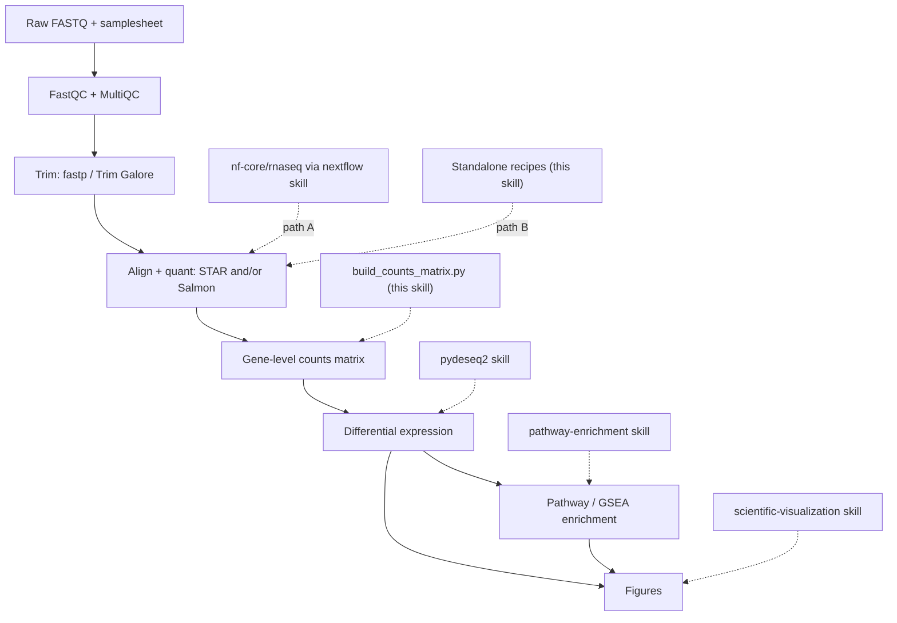

# Bulk RNA-seq(批量 RNA 测序)

## 概览

本技能负责编排一项完整、**站得住脚**（defensible）的批量 RNA-seq 差异表达研究，从原始测序 reads 一直到富集通路和图表。它是一个路由器(router),而非重新实现:大多数阶段在本仓库中已经有专门的技能，本技能只负责以正确的顺序把它们连接起来、填补唯一真正的空缺(原始 reads → 基因级计数矩阵),并强制执行决定最终结果是否可信的设计与 QC 决策。

「站得住脚」贯穿全程，意味着三件事:
- **可复现(Reproducible)** —— 锁定流水线/工具版本，尽量使用容器，记录参数，固定随机种子。
- **有 QC 把关(Quality-gated)** —— 在定量前、定量中、定量后都要检查 QC 并据此采取行动，而不是跳过。
- **统计上稳健(Statistically sound)** —— 充分的重复、与生物学相匹配的设计、正确处理的计数，以及受 FDR 控制的检验。

流水线为:**FastQC/trim → 比对/定量(STAR/Salmon) → 计数 → 差异表达(pydeseq2) → 富集(pathway-enrichment) → 图表**。

## 何时使用本技能

在用户想要以下操作时使用本技能:
- 从 FASTQ 文件(或一次测序运行)出发，得到差异表达基因和通路。
- 运行或配置 `nf-core/rnaseq`,或用 STAR、Salmon、featureCounts 进行比对/定量。
- 将 Salmon/STAR/featureCounts 的输出转换为可供 DESeq2/PyDESeq2 使用的计数矩阵。
- 在投入计算资源之前，设计或对批量 RNA-seq 实验做合理性检查(重复数、批次、链特异性)。
- 规划一次端到端的 RNA-seq 分析，并决定要串联哪些工具和技能。

这是**批量(bulk)** RNA-seq(样本 = 生物学标本)。对于单细胞/单核数据，使用 `scanpy`;单独的差异表达统计，使用 `pydeseq2`;单独的富集分析，使用 `pathway-enrichment`。

## 流水线一览



## 两条上游路径——任选其一

reads → 计数 这一阶段可以用两种方式运行。两者产出等价的基因计数；根据具体场景选择一条，选定后就保持在该路径上。

| 在以下情形使用 **路径 A —— `nf-core/rnaseq`**…… | 在以下情形使用 **路径 B —— 独立工具**…… |
|------------------------------------------|------------------------------------------|
| 你想要业界标准、经过审计、可引用的一条命令流水线 | 你的样本不多，想学习/检查每一步 |
| 样本数量多，或者要扩展到 HPC/云端 | 没有可用的 Nextflow/容器，或环境受限 |
| 可复现性和完整的 MultiQC 报告最重要 | 你需要该流水线未暴露的非标准步骤 |
| → 通过 **`nextflow`** 技能驱动它 | → 遵循 `references/upstream-manual.md` |

拿不准时，优先选 **路径 A**:`nf-core/rnaseq` 已经用经过审阅的合理默认值，把 FastQC → 修剪(trimming) → STAR/Salmon → 定量 → tximport → MultiQC 串联在一起，是最站得住脚的选项。路径 B 的存在是为了透明度和资源受限的场景。

两条路径最终都汇聚到**基因级计数矩阵**,之后的工作流程完全相同。

## 环境搭建

```bash
# 本技能的粘合层(桥接 + 交接)—— Python
uv pip install pytximport pandas

# 下游技能会安装各自的依赖:
#   pydeseq2 skill           -> uv pip install pydeseq2
#   pathway-enrichment skill -> uv pip install gseapy gprofiler-official

# 路径 A(nf-core):只需要 Nextflow + 容器引擎——见 `nextflow` 技能。

# 路径 B(独立工具):通过 bioconda 安装。为了可复现,锁定版本。
conda create -n rnaseq -c bioconda -c conda-forge \
  fastqc fastp trim-galore "star=2.7.11b" "salmon=1.10.3" subread multiqc
```

记录你所使用的确切版本(流水线版本、工具版本、参考基因组 + 注释发布版本)——这些内容应写入方法部分，并使分析可复现。

## 快速开始

### 路径 A —— nf-core/rnaseq(推荐)

```bash
# 0. 先校验 samplesheet(尽早发现最常见的失败)
python scripts/validate_samplesheet.py --samplesheet samplesheet.csv

# 1. 用打包的小型数据对环境做冒烟测试
nextflow run nf-core/rnaseq -r 3.26.0 -profile test,docker --outdir test_results

# 2. 正式运行:锁定版本,选择比对器,传入 samplesheet + 参考基因组
nextflow run nf-core/rnaseq -r 3.26.0 \
  -profile docker \
  --input samplesheet.csv \
  --genome GRCh38 \
  --aligner star_salmon \
  --outdir results \
  -resume
```

`nf-core/rnaseq` 内部运行 tximport,因此基因计数输出时**已经完成合并**——不需要桥接脚本。差异表达分析请使用 `results/star_salmon/salmon.merged.gene_counts_length_scaled.tsv`。Samplesheet 格式、比对器选择和输出:`references/upstream-nfcore.md`。关于引擎/HPC/云端/容器的细节，使用 **`nextflow`** 技能。

### 路径 B —— 独立的 STAR/Salmon(简略版)

```bash
fastqc -o qc/ reads/*.fastq.gz                      # 1. 对原始 reads 做 QC
fastp -i s1_R1.fq.gz -I s1_R2.fq.gz \
      -o s1_R1.trim.fq.gz -O s1_R2.trim.fq.gz \
      --thread 4 -j s1.fastp.json                   # 2. 修剪接头/低质量序列
salmon quant -i salmon_index -l A \
      -1 s1_R1.trim.fq.gz -2 s1_R2.trim.fq.gz \
      --gcBias --seqBias -p 8 -o quant/s1            # 3. 定量(逐样本)
```

完整流程(FastQC、fastp/Trim Galore、STAR 建索引+比对+`--quantMode GeneCounts`、支持 decoy 的 Salmon 索引、featureCounts、如何判定链特异性):`references/upstream-manual.md`。

### 计数 → 差异表达 → 富集(两条路径通用)

```bash
# 仅路径 B:为 PyDESeq2 组装基因 x 样本的计数矩阵 + 元数据模板
python scripts/build_counts_matrix.py --from salmon \
  --quant-dir quant/ --tx2gene tx2gene.tsv --output-dir counts/

# 然后交接(见对应的专门技能):
#   pydeseq2:           counts.csv + metadata.csv -> 差异表达结果表(log2FC、padj、stat)
#   pathway-enrichment: 按 `stat` 排序(GSEA),或使用 padj+|LFC| 命中列表(ORA)
#   scientific-visualization / matplotlib: 火山图、MA 图、热图、PCA、富集点图
```

## 分阶段工作流程

从上到下依次进行。每个阶段都标明了负责该细节的技能或文件。不要跳过设计/QC 阶段——批量 RNA-seq 研究最常在这些阶段出错。

1. **设计与样本表**。 确认每组 ≥3 个生物学重复，识别批次/混杂因素，并选定要比较的组别。构建 samplesheet,并用 `scripts/validate_samplesheet.py` 校验。原理与规则见 `references/design-and-qc.md`。
2. **原始 reads 的 QC**。 对每个文件运行 FastQC;用 MultiQC 汇总。检查逐碱基质量、接头含量、重复率和过度代表的序列。阈值见 `references/design-and-qc.md`。
3. **修剪(Trimming)**。 移除接头和低质量的末端(通过 `fastp` 或 `Trim Galore`)。重新运行 FastQC 加以确认。具体流程见 `references/upstream-manual.md`(路径 A 会替你完成这一步)。
4. **比对/定量**。 STAR(基因组比对 + `--quantMode GeneCounts`)和/或 Salmon(转录本准比对，支持 decoy)。确定链特异性——这一点很容易出错，而且出错时会在不知不觉中把计数削减一半。细节见 `references/upstream-manual.md`;流水线参数见 `references/upstream-nfcore.md`。
5. **构建计数矩阵**。 将定量输出转换为基因 × 样本的整数矩阵及元数据模板(`scripts/build_counts_matrix.py`)。关于估计计数与基因 ID 映射的细微之处，见 `references/counts-and-handoff.md`。
6. **差异表达 → `pydeseq2` 技能。** 加载 `counts.csv` + `metadata.csv`,设定设计公式(design,例如 `~batch + condition`),拟合，并在 FDR 控制下做检验。检查 PCA 图和 p 值直方图作为 QC。
7. **富集分析 → `pathway-enrichment` 技能。** 对于 GSEA,按 DESeq2 的 `stat` 对*完整*基因列表排序；对于 ORA,传入经过阈值筛选的命中列表(padj < 0.05,可选地加上 |log2FC| > 1)。先将基因 ID 映射为基因符号。
8. **图表 → `scientific-visualization` 技能。** 火山图、MA 图、样本距离热图、PCA,以及富集点图，再加上用于 QC 叙述的 MultiQC 报告。

## 计数 → 差异表达 桥接(关键的粘合层)

这是唯一一个没有上游/下游技能覆盖的阶段，因此由本技能负责。`scripts/build_counts_matrix.py` 会把定量输出转换为 `pydeseq2` 所期望的确切格式:

- **Salmon**(`--from salmon`):使用 `pytximport`,以 `counts_from_abundance="length_scaled_tpm"`(基因级差异表达的正确选择)将每个样本的 `quant.sf` 聚合到基因级，需要一个 `tx2gene` 映射表。
- **STAR**(`--from star`):读取每个 `ReadsPerGene.out.tab`,根据你的 `--strandedness`(unstranded/forward/reverse)选择对应的列。
- **featureCounts**(`--from featurecounts`):解析合并后的 `featureCounts` 矩阵。

它会写出 `counts.csv`(基因 × 样本，整数)和 `metadata_template.csv`(每个样本一行)供你填写。**Salmon/RSEM 的计数是估计值(非整数);会被四舍五入为整数**,因为 PyDESeq2 需要整数计数——为什么在使用 `length_scaled_tpm` 时这样做是可以接受的、以及它与基于偏移量(offset-based)的 DESeq2+tximport 路线有何不同，见 `references/counts-and-handoff.md`。该参考文件还涵盖了 Ensembl→基因符号的映射(在富集分析之前需要)以及 PyDESeq2 所要求的确切数据朝向(orientation)。

## 常见陷阱

以下是导致大多数错误或不可复现的批量 RNA-seq 结果的原因:

1. **重复数太少**。 每组 <3 个生物学重复几乎没有统计功效，离散度估计也不稳定。更多重复胜过更深的测序深度。
2. **批次与条件混杂**。 如果每个处理样本都在与对照不同的日期/泳道处理，这种效应是无法挽回的。要随机化，并对已知批次建模(`~batch + condition`)。见 `references/design-and-qc.md`。
3. **链特异性选错**。 选错 STAR 的列，或选错 featureCounts 的 `-s`/Salmon 的文库类型，会在不知不觉中丢弃约一半的 reads。使用 Salmon 的 `-l A` 或推断链特异性，并核实分配到的 reads 比例。
4. **把 TPM/FPKM 喂给 DESeq2**。 DESeq2 需要的是**原始（或经长度缩放的）计数**，绝不能是 TPM/FPKM/归一化后的值。桥接脚本会处理这一点。
5. **非整数计数**。 PyDESeq2 要求整数；将 Salmon 的估计值四舍五入(桥接脚本会完成这一步)。
6. **进入富集分析时基因 ID 不匹配**。 DESeq2 的输出通常是 Ensembl ID;Enrichr/MSigDB 需要的是基因符号。在 `pathway-enrichment` 之前先映射 ID,否则会出现「什么都不显著」的假象。
7. **跳过定量后的 QC**。 在信任差异表达结果之前，务必先查看 PCA 图和样本距离热图——它们能揭示标签互换、离群值和隐藏的批次效应。
8. **跨样本混用不同比对器**。 对每一个样本都使用相同的工具、版本、参考基因组和参数进行定量。
9. **版本未锁定**。 "latest" 版本的流水线/基因组会使结果不可复现；要锁定 `-r`、工具版本，以及基因组/注释的发布版本。

## 与其他技能的集成

- **上游执行**: `nextflow`(运行 `nf-core/rnaseq`,路径 A;HPC/云端/容器)。
- **参考数据/基因 ID**: `gget`(`gget ref` 获取基因组+GTF,`gget info`/`gget search` 做 ID 映射)、`database-lookup`(Ensembl/NCBI)、`biopython`/`pysam`(FASTA/BAM 处理)。
- **差异表达**: `pydeseq2`(本技能把计数交接给它的差异表达引擎)。
- **富集分析**: `pathway-enrichment`(ORA + GSEA;它的 `scripts/run_enrichment.py` 可以直接读取 DESeq2 结果 CSV)。
- **图表与报告**: `scientific-visualization`、`matplotlib`、`seaborn`;方法/结果叙述部分用 `scientific-writing`。
- **相关但不同**: `scanpy`(单细胞)、`statistical-analysis`(多重检验的深入内容)。

## 参考文件

需要深入了解时阅读相应文件——每个文件都是自包含的:

- `references/upstream-nfcore.md` —— 路径 A:samplesheet 格式、`--aligner`/`--pseudo_aligner` 的选择、关键参数、`salmon.merged.gene_counts*.tsv` 输出、MultiQC,以及要交给 `pydeseq2` 的内容。
- `references/upstream-manual.md` —— 路径 B:FastQC、fastp/Trim Galore、STAR 基因组索引 + 比对 + `--quantMode GeneCounts`、支持 decoy 的 Salmon 索引 + `quant`、featureCounts,以及如何判定链特异性。
- `references/counts-and-handoff.md` —— 如何把定量输出转换为 PyDESeq2 就绪的 `counts.csv`/`metadata.csv`(pytximport、STAR 列选择、featureCounts)、整数/估计计数的细微之处、Ensembl→基因符号映射，以及差异表达→富集分析的排序/命中列表配方。
- `references/design-and-qc.md` —— 实验设计(重复、批次、混杂因素、设计公式)以及 QC 指标的解读(比对率、重复率、rRNA、复杂度、PCA/离群值)——这是站得住脚的流水线的支柱。

## 资源

- nf-core/rnaseq: https://nf-co.re/rnaseq · STAR: https://github.com/alexdobin/STAR · Salmon: https://salmon.readthedocs.io
- fastp: https://github.com/OpenGene/fastp · Trim Galore: https://github.com/FelixKrueger/TrimGalore · MultiQC: https://multiqc.info
- pytximport: https://pytximport.complextissue.com · featureCounts (Subread): https://subread.sourceforge.net
- 方法背景文献:Love et al. 2014(DESeq2)DOI 10.1186/s13059-014-0550-8 · Soneson et al. 2015(tximport)DOI 10.12688/f1000research.7563.2
