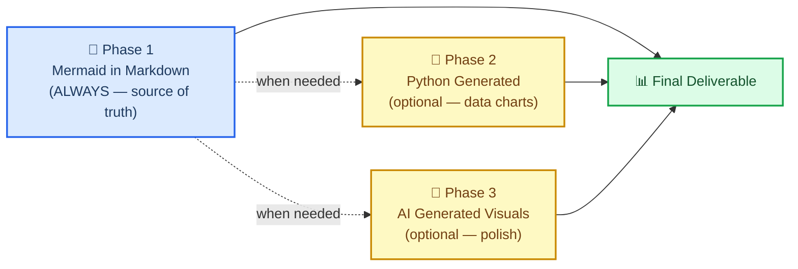
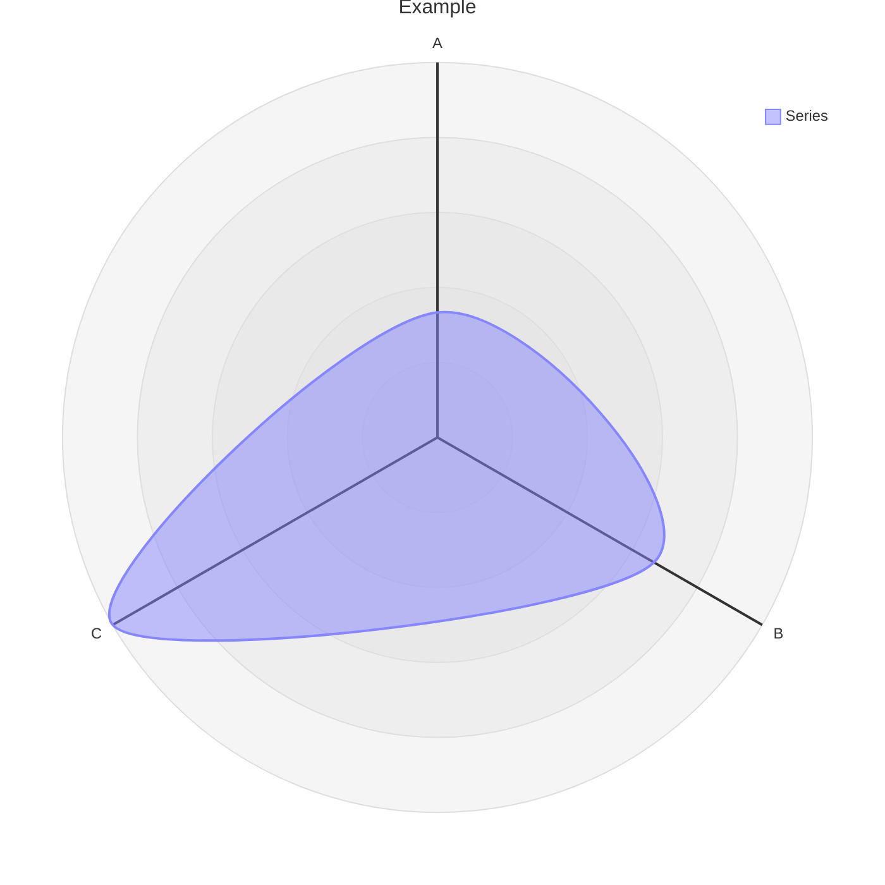

# Markdown 与 Mermaid 写作

## 概述

本技能教你——并在你身上执行一项标准——使用**以嵌入 Mermaid 图表的 markdown 作为默认且规范的格式**来创建科学文档。

核心判断是：在 `.md` 文件中以 Mermaid 图表表达的一段关系，比任何图片都更有价值。它是文本，因此在 git 中能干净地生成差异（diff）。它不需要任何构建步骤。它能在 GitHub、GitLab、Notion、VS Code 以及任何 markdown 查看器中原生渲染。它比用散文描述同一关系所耗费的 token 更少。而且它随时都可以在之后转换为精美的图片——但文本版本始终是唯一可信来源（source of truth）。

> "把你的报告和文件尽量以 .md 加普通文本的形式呈现,Mermaid 本身也是这样，同时它又是一种简单的'脚本语言'。这对任何下游渲染都有帮助，尤其是对 AI 生成的图像而言(用 Mermaid 而不是冗长的文字来描述各种关系，能省下更多 token)。此外,Mermaid 还能与 markdown 一起渲染，无论对人还是对 AI 来说，几乎在任何地方都能轻松使用。"
>
> —— Clayton Young（@borealBytes）,K-Dense Discord,2026-02-19

## 何时使用此技能

在以下情况下使用此技能：

- 创建**任何科学文档**——报告、分析、手稿、方法学章节
- 编写**任何文档**——README、操作指南、决策记录、项目文档
- 制作**任何图表**——工作流程、数据管道、架构、时间线、关系图
- 生成**任何将被纳入版本控制的输出**——如果它要进 git,就应该是 markdown
- 与**任何其他技能**配合使用——本技能定义了包裹在其他一切输出之外的文档层
- 有人要求你"加一张图"或"把这个关系可视化"——一律优先使用 Mermaid

对于结构性或关系性的图表,**不要**一上来就用 Python 的 matplotlib、seaborn 或 AI 图像生成。
那些属于第二阶段和第三阶段——只有在 Mermaid 无法表达所需内容时才使用(例如带真实数据的散点图、照片级真实感图像)。

## 🎨 源格式理念

### 为什么基于文本的图表更胜一筹

| 关注点 | Markdown 中的 Mermaid | Python / AI 生成图像 |
| ----------------------------- | :-----------------: | :---------------: |
| Git 差异（diff）可读 | ✅ | ❌ 二进制大对象 |
| 无需重新生成即可编辑 | ✅ | ❌ |
| 相较散文更省 token | ✅ 更少 | ❌ 更多 |
| 无需构建步骤即可渲染 | ✅ | ❌ 需要托管 |
| AI 无需视觉能力即可解析 | ✅ | ❌ |
| 在 GitHub / GitLab / Notion 中可用 | ✅ | ⚠️ 需托管才行 |
| 可访问性（屏幕阅读器） | ✅ accTitle/accDescr | ⚠️ 需要替代文字 |
| 之后可转换为图片 | ✅ 随时可以 | —— 本身已是图片 |

### 三阶段工作流程



**第一阶段是强制性的**。 即便你进一步推进到第二或第三阶段,Mermaid 源码也必须始终留在提交记录中。

### Mermaid 能表达什么

Mermaid 覆盖 24 种图表类型。几乎每一种科学关系都能在其中找到对应类型：

| 使用场景 | 图表类型 | 文件 |
| -------------------------------------------- | ---------------- | ---------------------------------------------------- |
| 实验流程 / 决策逻辑 | 流程图（Flowchart） | `references/diagrams/flowchart.md` |
| 服务交互 / API 调用 / 消息传递 | 时序图（Sequence） | `references/diagrams/sequence.md` |
| 数据模型 / 架构 | ER 图 | `references/diagrams/er.md` |
| 状态机 / 生命周期 | 状态图（State） | `references/diagrams/state.md` |
| 项目时间线 / 路线图 | 甘特图（Gantt） | `references/diagrams/gantt.md` |
| 比例 / 构成 | 饼图（Pie） | `references/diagrams/pie.md` |
| 系统架构（多层缩放级别） | C4 图 | `references/diagrams/c4.md` |
| 概念层级 / 头脑风暴 | 思维导图（Mindmap） | `references/diagrams/mindmap.md` |
| 按时间顺序排列的事件 / 历史 | 时间轴（Timeline） | `references/diagrams/timeline.md` |
| 类层级 / 类型关系 | 类图（Class） | `references/diagrams/class.md` |
| 用户旅程 / 满意度地图 | 用户旅程图（User Journey） | `references/diagrams/user_journey.md` |
| 双轴对比 / 优先级排序 | 象限图（Quadrant） | `references/diagrams/quadrant.md` |
| 需求可追溯性 | 需求图（Requirement） | `references/diagrams/requirement.md` |
| 流量大小 / 资源分布 | 桑基图（Sankey） | `references/diagrams/sankey.md` |
| 数值趋势 / 柱状图 + 折线图 | XY 图表 | `references/diagrams/xy_chart.md` |
| 组件布局 / 空间排布 | 区块图（Block） | `references/diagrams/block.md` |
| 工作项状态 / 任务列 | 看板（Kanban） | `references/diagrams/kanban.md` |
| 云基础设施 / 服务拓扑 | 架构图（Architecture） | `references/diagrams/architecture.md` |
| 多维度对比 / 能力雷达 | 雷达图（Radar） | `references/diagrams/radar.md` |
| 层级化占比 / 预算 | 矩形树图（Treemap） | `references/diagrams/treemap.md` |
| 二进制协议 / 数据格式 | 数据包图（Packet） | `references/diagrams/packet.md` |
| Git 分支 / 合并策略 | Git 分支图（Git Graph） | `references/diagrams/git_graph.md` |
| 代码风格时序图（编程语法） | ZenUML | `references/diagrams/zenuml.md` |
| 多图表组合模式 | 复合示例（Complex Examples） | `references/diagrams/complex_examples.md` |

> 💡 **选对类型，而不是选简单的那种**。 不要什么都默认用流程图。
> 对于按时间顺序发生的事件，时间轴比流程图更合适。对于服务间交互,
> 时序图比流程图更合适。逐一对照上表，匹配最合适的类型。

---

## 🔧 核心工作流程

### 第一步：确定文档类型

在从零开始写作之前，先检查是否已有可用模板：

| 文档类型 | 模板 |
| ------------------------------ | ----------------------------------------------- |
| 拉取请求（Pull Request）记录 | `templates/pull_request.md` |
| 议题 / 缺陷 / 功能请求 | `templates/issue.md` |
| 冲刺 / 项目看板 | `templates/kanban.md` |
| 架构决策记录（ADR） | `templates/decision_record.md` |
| 演示文稿 / 简报 | `templates/presentation.md` |
| 研究论文 / 分析报告 | `templates/research_paper.md` |
| 项目文档 | `templates/project_documentation.md` |
| 操作指南 / 教程 | `templates/how_to_guide.md` |
| 状态报告 | `templates/status_report.md` |

### 第二步：阅读风格指南

在编写任何 `.md` 文件之前：先阅读 `references/markdown_style_guide.md`。

需要内化的关键规则：

- **每篇文档只有一个 H1**——即标题。绝不能多于一个。
- **仅在 H2 标题上使用 emoji**——每个 H2 一个 emoji,H3/H4 中一律不用
- **一切都要注明出处**——每一条外部引用的论断都要配上带完整 URL 的脚注 `[^N]`
- **粗体要用得克制**——每段最多 2-3 个加粗词，绝不要把整句话加粗
- **每个 `</details>` 之后都要加水平分隔线**——这是强制要求
- 对于对比、配置、结构化数据,**用表格而不是散文**
- **用图表代替大段文字**——只要是在描述流程、结构或关系，就加上 Mermaid 图

### 第三步：选定图表类型并阅读对应指南

在创建任何 Mermaid 图表之前:先阅读 `references/mermaid_style_guide.md`。

然后打开对应类型的具体文件(例如 `references/diagrams/flowchart.md`)以获取示例、技巧和可直接复制粘贴的模板。

每一张图表都必须遵守的规则：

```
accTitle: Short Name 3-8 Words
accDescr: One or two sentences explaining what this diagram shows.
```

- **不要使用 `%%{init}` 指令**——会破坏 GitHub 的深色模式
- **不要使用行内 `style`**——只使用 `classDef`
- **每个节点最多一个 emoji**——放在标签开头
- **节点 ID 使用 `snake_case`**——与标签保持对应

### 第四步：编写文档

从模板开始。应用 markdown 风格指南。把图表放在相关文字的旁边内联展示——而不是单独放进一个"图表"章节。

### 第五步：以文本形式提交

带有内嵌 Mermaid 的 `.md` 文件才是需要提交的对象。如果你还生成了 PNG 或 AI 图像，那些只是补充材料——markdown 才是唯一可信来源。

---

## ⚠️ 常见坑

### 雷达图语法（`radar-beta`）

**错误写法**：
```mermaid
radar
title Example
x-axis ["A", "B", "C"]
"Series" : [1, 2, 3]
```

**正确写法**：


- **使用 `radar-beta`**,而不是 `radar`(单独的 `radar` 关键字并不存在)
- **使用 `axis`** 来定义维度,**而不是** `x-axis`
- **使用 `curve`** 来定义数据系列,**而不是**带引号标签加冒号的写法
- **不支持 `accTitle`/`accDescr`**——radar-beta 不支持可访问性注释；应始终在图表上方添加一段描述性的斜体文字

### XY 图表与雷达图的混淆

| 图表 | 关键字 | 坐标轴语法 | 数据语法 |
| ------- | ------- | ----------- | ----------- |
| **XY 图表**（柱状图/折线图） | `xychart-beta` | `x-axis ["Label1", "Label2"]` | `bar [10, 20]` 或 `line [10, 20]` |
| **雷达图**（蜘蛛图/网状图） | `radar-beta` | `axis id["Label"]` | `curve id["Label"]{10, 20}` |

### 在支持的类型上忘记写 `accTitle`/`accDescr`

只有部分图表类型支持 `accTitle`/`accDescr`。对于不支持的类型，应始终在代码块正上方放置一段描述性的斜体文字：

> _雷达图，比较三种方法在五个性能维度上的表现。注意:雷达图不支持 accTitle/accDescr。_


---

## 🔗 与其他技能的集成

### 与 `scientific-schematics` 配合

`scientific-schematics` 生成由 AI 制作的、达到出版质量的图像(PNG)。把 Mermaid 图表当作制作该示意图的**需求说明（brief）**：

```
工作流程：
1. 在 .md 中把这个概念创建为 Mermaid 图(本技能——第一阶段)
2. 把同一个概念描述给 scientific-schematics,生成精美的 PNG(第三阶段)
3. 两者都提交——.md 作为源,PNG 作为补充图示
```

### 与 `scientific-writing` 配合

当 `scientific-writing` 生成一份手稿时，其中所有图表和结构性插图都应遵循本技能的标准。写作技能负责散文正文与引用；本技能负责视觉结构。

```
工作流程：
1. 使用 scientific-writing 起草手稿
2. 对每一处展示工作流程、架构或关系的插图：
   - 用遵循本技能指南的 Mermaid 图表替换占位符
3. 只有在真正需要照片级真实感/复杂渲染的插图上才使用 scientific-schematics
```

### 与 `literature-review` 配合

文献综述会产出带有大量关系数据的摘要。可用本技能来:

- 制作文献全貌的概念图(思维导图 Mindmap)
- 展示发表时间线(时间轴 Timeline 或甘特图 Gantt)
- 比较研究方法(象限图 Quadrant 或雷达图 Radar)
- 把论文中描述的数据流绘制成图(时序图 Sequence 或流程图 Flowchart)

### 与任何产出文档的技能配合

在最终定稿任何技能产出的文档之前，应用本技能的检查清单：

- [ ] 该文档是否使用了模板?若使用了，是否用对了模板?
- [ ] 所有图表是否都是 Mermaid 格式，并带有 `accTitle` + `accDescr`?
- [ ] 是否没有 `%%{init}`、没有行内 `style`,只用了 `classDef`?
- [ ] 所有外部论断是否都用 `[^N]` 标注了出处?
- [ ] 是否只有一个 H1,且 emoji 只出现在 H2 上?
- [ ] 每个 `</details>` 之后是否都加了水平分隔线?

---

## 📚 参考索引

### 风格指南

| 指南 | 路径 | 行数 | 涵盖内容 |
| ----------------------- | ------------------------------------------- | ----- | -------------------------------------------------- |
| Markdown 风格指南 | `references/markdown_style_guide.md` | 约 733 行 | 标题、格式、引用、表格、Mermaid 集成、模板、质量检查清单 |
| Mermaid 风格指南 | `references/mermaid_style_guide.md` | 约 458 行 | 可访问性、emoji 集合、颜色分类、主题中立性、类型选择、复杂度分级 |

### 图表类型指南（24 种类型）

每个文件都包含:达到生产质量的示例、该类型专属的技巧，以及一份可直接复制粘贴的模板。

`references/diagrams/` —— architecture、block、c4、class、complex_examples、er、flowchart、gantt、git_graph、kanban、mindmap、packet、pie、quadrant、radar、requirement、sankey、sequence、state、timeline、treemap、user_journey、xy_chart、zenuml

### 文档模板（9 种类型）

`templates/` —— decision_record、how_to_guide、issue、kanban、presentation、project_documentation、pull_request、research_paper、status_report

### 示例

`assets/examples/example-research-report.md` —— 一份完整的科学研究报告，展示了正确的标题层级、多种图表类型(流程图、时序图、甘特图)、表格、脚注引用、可折叠区块，以及所有风格指南规则的实际应用。

---

## 📝 版权说明

本技能中的所有风格指南、图表类型指南与文档模板，均依据 Apache-2.0 许可证从 `SuperiorByteWorks-LLC/agent-project` 仓库移植而来。

- **来源**：https://github.com/SuperiorByteWorks-LLC/agent-project
- **作者**：Clayton Young / Superior Byte Works, LLC (@borealBytes)
- **许可证**：Apache-2.0

本技能(作为 scientific-agent-skills 的一部分)依据 MIT 许可证分发。其中包含的 Apache-2.0 内容在保留署名的前提下兼容下游使用，如本技能各处文件头部所保留的那样。

---

[^1]: GitHub Blog. (2022). "Include diagrams in your Markdown files with Mermaid." https://github.blog/2022-02-14-include-diagrams-markdown-files-mermaid/

[^2]: Mermaid. "Mermaid Diagramming and Charting Tool." https://mermaid.js.org/
