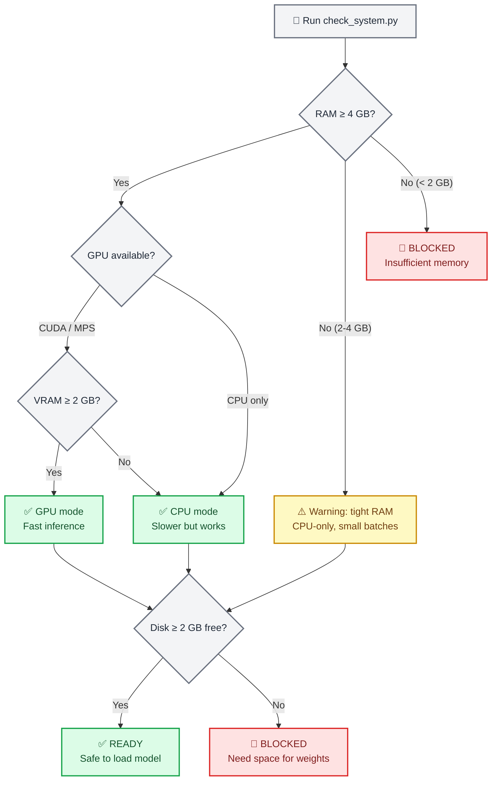
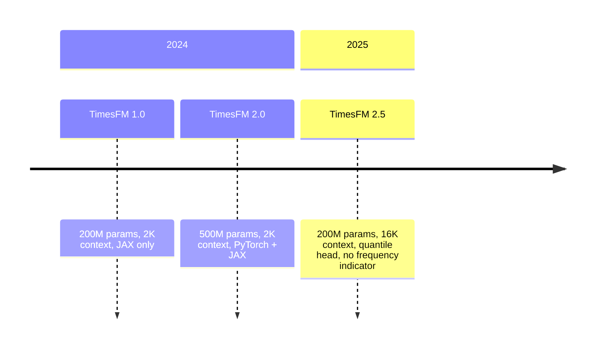

# TimesFM Forecasting

## 概述

TimesFM(Time Series Foundation Model,时间序列基础模型)是由 Google Research 开发的一个预训练的、仅解码器(decoder-only)的时间序列预测基础模型。它可以**零样本**（zero-shot）工作——喂给它任意的单变量时间序列，它就能返回带有经过校准的分位数预测区间的点预测，无需训练。

这份技能把 TimesFM 封装成安全的、对智能体友好的本地推理。它包含一个**强制性的预检系统检查器(preflight system checker)**,在加载模型之前先核实 RAM、GPU 显存和磁盘空间，以确保智能体绝不会让用户的机器崩溃。

> **关键数字**:TimesFM 2.5 使用 2 亿(200M)参数(磁盘上约 800 MB,CPU 上 RAM 中约 1.5 GB,GPU 上约 1 GB 显存)。已归档的 v1/v2 版本、5 亿(500M)参数的模型需要约 32 GB RAM。
> 请始终先运行系统检查器。

## 何时使用此技能

在以下情况使用此技能:

- 预测**任意单变量时间序列**(销售、需求、传感器、生命体征、价格、天气)
- 需要**零样本预测**,不训练自定义模型
- 想要带有经过校准的预测区间(分位数)的**概率化预测**
- 时间序列的长度**任意**(该模型可处理 1 至 16,384 个上下文点)
- 需要高效地**批量预测**成百上千条序列
- 想要一种**基础模型**的方式，而不是手动调 ARIMA/ETS 参数

**不要**使用此技能的情形:

- 需要具有系数可解释性的经典统计模型 → 使用 `statsmodels`
- 需要时间序列分类或聚类 → 使用 `aeon`
- 需要多变量向量自回归或格兰杰因果检验 → 使用 `statsmodels`
- 你的数据是表格型(非时序)的 → 使用 `scikit-learn`

> **关于异常检测的说明**:TimesFM 并没有内置的异常检测功能，但你可以
> 把**分位数预测用作预测区间**——落在 90% 置信区间(q10–q90)之外的值
> 在统计上是异常的。完整示例见 `examples/anomaly-detection/` 目录。

## ⚠️ 强制性预检:系统需求检查

**至关重要——在首次加载模型之前，始终先运行系统检查器**。

```bash
python scripts/check_system.py
```

该脚本会检查:

1. **可用 RAM** —— 低于 4 GB 时告警，低于 2 GB 时阻断
2. **GPU 可用性** —— 检测 CUDA/MPS 设备及显存(VRAM)
3. **磁盘空间** —— 核实是否有约 800 MB 的空间用于模型下载
4. **Python 版本** —— 要求 3.10+
5. **已有安装** —— 检查 `timesfm` 和 `torch` 是否已安装

> **注意**: 模型权重**不存放在此仓库中**。TimesFM 权重(约 800 MB)
> 会在首次使用时从 HuggingFace 按需下载，并缓存在 `~/.cache/huggingface/` 中。
> 预检检查器会在任何下载开始之前确保资源充足。



### 各模型版本的硬件需求

| 模型 | 参数量 | RAM(CPU) | 显存(GPU) | 磁盘 | 上下文长度 |
| ----- | ---------- | --------- | ---------- | ---- | ------- |
| **TimesFM 2.5**(推荐) | 200M | ≥ 4 GB | ≥ 2 GB | ~800 MB | 最多 16,384 |
| TimesFM 2.0(已归档) | 500M | ≥ 16 GB | ≥ 8 GB | ~2 GB | 最多 2,048 |
| TimesFM 1.0(已归档) | 200M | ≥ 8 GB | ≥ 4 GB | ~800 MB | 最多 2,048 |

> **建议**:除非有特定理由需要使用旧版检查点(checkpoint),否则始终使用
> TimesFM 2.5。它更小、更快，并支持 8 倍长的上下文。

## 🔧 安装

### 第 1 步:核实系统(始终最先做)

```bash
python scripts/check_system.py
```

### 第 2 步:安装 TimesFM

```bash
# Using uv (recommended by this repo)
uv pip install timesfm[torch]

# For JAX/Flax backend (faster on TPU/GPU)
uv pip install timesfm[flax]
```

### 第 3 步:为你的硬件安装 PyTorch

```bash
# CUDA 12.1 (NVIDIA GPU)
uv pip install torch>=2.0.0 --index-url https://download.pytorch.org/whl/cu121

# CPU only
uv pip install torch>=2.0.0 --index-url https://download.pytorch.org/whl/cpu

# Apple Silicon (MPS)
uv pip install torch>=2.0.0  # MPS support is built-in
```

### 第 4 步:核实安装

```python
import timesfm
import numpy as np
print(f"TimesFM version: {timesfm.__version__}")
print("Installation OK")
```

## 🎯 快速开始

### 最小示例(5 行)

```python
import torch, numpy as np, timesfm

torch.set_float32_matmul_precision("high")

model = timesfm.TimesFM_2p5_200M_torch.from_pretrained(
    "google/timesfm-2.5-200m-pytorch"
)
model.compile(timesfm.ForecastConfig(
    max_context=1024, max_horizon=256, normalize_inputs=True,
    use_continuous_quantile_head=True, force_flip_invariance=True,
    infer_is_positive=True, fix_quantile_crossing=True,
))

point, quantiles = model.forecast(horizon=24, inputs=[
    np.sin(np.linspace(0, 20, 200)),  # any 1-D array
])
# point.shape == (1, 24)        — median forecast
# quantiles.shape == (1, 24, 10) — 10th–90th percentile bands
```

### 从 CSV 进行预测

```python
import pandas as pd, numpy as np

df = pd.read_csv("monthly_sales.csv", parse_dates=["date"], index_col="date")

# Convert each column to a list of arrays
inputs = [df[col].dropna().values.astype(np.float32) for col in df.columns]

point, quantiles = model.forecast(horizon=12, inputs=inputs)

# Build a results DataFrame
for i, col in enumerate(df.columns):
    last_date = df[col].dropna().index[-1]
    future_dates = pd.date_range(last_date, periods=13, freq="MS")[1:]
    forecast_df = pd.DataFrame({
        "date": future_dates,
        "forecast": point[i],
        "lower_80": quantiles[i, :, 2],  # 20th percentile
        "upper_80": quantiles[i, :, 8],  # 80th percentile
    })
    print(f"\n--- {col} ---")
    print(forecast_df.to_string(index=False))
```

### 带协变量(XReg)的预测

TimesFM 2.5+ 通过 `forecast_with_covariates()` 支持外生变量。需要 `timesfm[xreg]`。

```python
# Requires: uv pip install timesfm[xreg]
point, quantiles = model.forecast_with_covariates(
    inputs=inputs,
    dynamic_numerical_covariates={"price": price_arrays},
    dynamic_categorical_covariates={"holiday": holiday_arrays},
    static_categorical_covariates={"region": region_labels},
    xreg_mode="xreg + timesfm",  # or "timesfm + xreg"
)
```

| 协变量类型 | 说明 | 示例 |
| -------------- | ----------- | ------- |
| `dynamic_numerical` | 随时间变化的数值型 | 价格、温度、促销支出 |
| `dynamic_categorical` | 随时间变化的类别型 | 节假日标志、星期几 |
| `static_numerical` | 每条序列固定的数值型 | 门店规模、账户年限 |
| `static_categorical` | 每条序列固定的类别型 | 门店类型、地区、产品类别 |

**XReg 模式**:
- `"xreg + timesfm"`(默认):先由 TimesFM 预测，再由 XReg 调整残差
- `"timesfm + xreg"`:先由 XReg 拟合，再由 TimesFM 预测残差

> 完整示例(含合成零售数据)见 `examples/covariates-forecasting/`。

### 异常检测(通过分位数区间)

TimesFM 没有内置的异常检测功能，但**分位数预测天然提供了
可用于检测异常的预测区间**:

```python
point, q = model.forecast(horizon=H, inputs=[values])

# 90% prediction interval
lower_90 = q[0, :, 1]  # 10th percentile
upper_90 = q[0, :, 9]  # 90th percentile

# Detect anomalies: values outside the 90% CI
actual = test_values  # your holdout data
anomalies = (actual < lower_90) | (actual > upper_90)

# Severity levels
is_warning = (actual < q[0, :, 2]) | (actual > q[0, :, 8])  # outside 80% CI
is_critical = anomalies  # outside 90% CI
```

| 严重程度 | 条件 | 解读 |
| -------- | --------- | -------------- |
| **正常(Normal)** | 落在 80% 置信区间内 | 符合预期的行为 |
| **告警(Warning)** | 落在 80% 置信区间外 | 不常见但可能发生 |
| **严重(Critical)** | 落在 90% 置信区间外 | 统计上罕见(概率 < 10%) |

> 含可视化的完整示例见 `examples/anomaly-detection/`。

```python
# Requires: uv pip install timesfm[xreg]
point, quantiles = model.forecast_with_covariates(
    inputs=inputs,
    dynamic_numerical_covariates={"temperature": temp_arrays},
    dynamic_categorical_covariates={"day_of_week": dow_arrays},
    static_categorical_covariates={"region": region_labels},
    xreg_mode="xreg + timesfm",  # or "timesfm + xreg"
)
```

## 输出、配置、工作流与调优

- [references/output_and_config.md](references/output_and_config.md):如何读取点
  预测和 10 个分位数区间、如何推导预测区间，以及每一个
  `ForecastConfig` 字段。
- [references/workflows.md](references/workflows.md):标准预测流程、
  从一份宽表 CSV 进行多序列预测，以及带区间覆盖率的回测(backtesting)。
- [references/performance_tuning.md](references/performance_tuning.md):GPU 与 TF32
  设置、按可用内存确定 `per_core_batch_size`,以及内存管理。
- [references/examples_and_validation.md](references/examples_and_validation.md):
  可运行的示例、质量核对清单、常见错误，以及回归检查。

## 🔗 与其他技能的集成

### 与 `statsmodels` 集成

用 `statsmodels` 做经典模型(ARIMA、SARIMAX),作为**对比基线**:

```python
# TimesFM forecast
tfm_point, tfm_q = model.forecast(horizon=H, inputs=[values])

# statsmodels ARIMA forecast
from statsmodels.tsa.arima.model import ARIMA
arima = ARIMA(values, order=(1,1,1)).fit()
arima_forecast = arima.forecast(steps=H)

# Compare
print(f"TimesFM MAE: {np.mean(np.abs(actual - tfm_point[0])):.2f}")
print(f"ARIMA MAE:   {np.mean(np.abs(actual - arima_forecast)):.2f}")
```

### 与 `matplotlib` / `scientific-visualization` 集成

将带有预测区间的预测结果绘制成出版级质量的图。

### 与 `exploratory-data-analysis` 集成

在预测之前对时间序列进行 EDA(探索性数据分析),以理解趋势、季节性和平稳性。


## 📚 可用脚本

### `scripts/check_system.py`

**强制性预检检查器**。 在首次加载模型之前运行。

```bash
python scripts/check_system.py
```

输出示例:
```
=== TimesFM System Requirements Check ===

[RAM]       Total: 32.0 GB | Available: 24.3 GB  ✅ PASS
[GPU]       NVIDIA RTX 4090 | VRAM: 24.0 GB      ✅ PASS
[Disk]      Free: 142.5 GB                        ✅ PASS
[Python]    3.12.1                                 ✅ PASS
[timesfm]   Installed (2.5.0)                      ✅ PASS
[torch]     Installed (2.4.1+cu121)                ✅ PASS

VERDICT: ✅ System is ready for TimesFM 2.5 (GPU mode)
Recommended: per_core_batch_size=128
```

### `scripts/forecast_csv.py`

端到端的 CSV 预测，附带自动系统检查。

```bash
python scripts/forecast_csv.py input.csv \
    --horizon 24 \
    --date-col date \
    --value-cols sales,revenue \
    --output forecasts.csv
```

## 📖 参考文档

`references/` 目录中有详细指南:

| 文件 | 内容 |
| ---- | -------- |
| `references/system_requirements.md` | 硬件档位、GPU/CPU 选择、内存估算公式 |
| `references/api_reference.md` | 完整的 `ForecastConfig` 文档、`from_pretrained` 选项、输出形状 |
| `references/data_preparation.md` | 输入格式、NaN 处理、CSV 加载、协变量设置 |

## 常见坑点

1. **没有运行系统检查** → 在低 RAM 机器上模型加载会崩溃。始终先运行 `check_system.py`。
2. **忘记调用 `model.compile()`** → `RuntimeError: Model is not compiled`。必须在 `forecast()` 之前调用 `compile()`。
3. **没有设置 `normalize_inputs=True`** → 对于数值较大的序列，预测会不稳定。
4. **在内存小于 32 GB 的机器上使用 v1/v2** → 改用 TimesFM 2.5(200M 参数)。
5. **没有设置 `fix_quantile_crossing=True`** → 分位数可能不满足单调性(q10 > q50)。
6. **在小 GPU 上使用过大的 `per_core_batch_size`** → CUDA OOM(显存溢出)。从小开始，逐步增大。
7. **传入二维数组** → TimesFM 期望的是**一维数组的列表**,而不是一个二维矩阵。
8. **忘记 `torch.set_float32_matmul_precision("high")`** → 在 Ampere 及更新架构的 GPU 上推理更慢。
9. **没有处理输出中的 NaN** → 对于非常短的序列会出现边界情况。始终检查 `np.isnan(point).any()`。
10. **对可能为负值的序列使用 `infer_is_positive=True`** → 会把预测值截断为零。对于温度、收益率等，应设为 False。

## 模型版本



| 版本 | 参数量 | 上下文长度 | 分位数头(Quantile Head) | 频率标志 | 状态 |
| ------- | ------ | ------- | ------------- | -------------- | ------ |
| **2.5** | 200M | 16,384 | ✅ 连续(30M) | ❌ 已移除 | **最新** |
| 2.0 | 500M | 2,048 | ✅ 固定分桶 | ✅ 必需 | 已归档 |
| 1.0 | 200M | 2,048 | ✅ 固定分桶 | ✅ 必需 | 已归档 |

**Hugging Face 检查点**:

- `google/timesfm-2.5-200m-pytorch`(推荐)
- `google/timesfm-2.5-200m-flax`
- `google/timesfm-2.0-500m-pytorch`(已归档)
- `google/timesfm-1.0-200m-pytorch`(已归档)

## 资源

- **论文**: [A Decoder-Only Foundation Model for Time-Series Forecasting](https://arxiv.org/abs/2310.10688) (ICML 2024)
- **仓库**: https://github.com/google-research/timesfm
- **Hugging Face**: https://huggingface.co/collections/google/timesfm-release-66e4be5fdb56e960c1e482a6
- **Google 博客**: https://research.google/blog/a-decoder-only-foundation-model-for-time-series-forecasting/
- **BigQuery 集成**: https://cloud.google.com/bigquery/docs/timesfm-model
